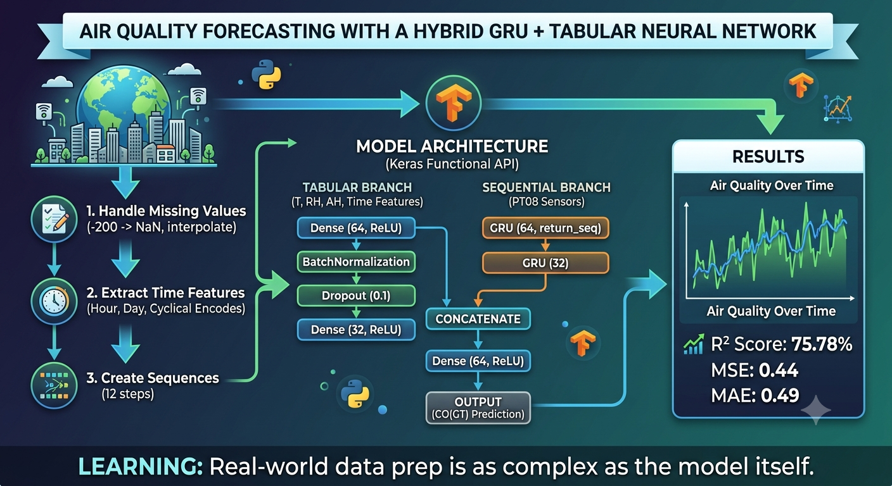

# Air Quality Forecasting Using Hybrid GRU and Tabular Neural Network

## Project Overview

This project predicts air quality measurements using a hybrid deep learning architecture built with the Keras Functional API.

The model combines:

- **GRU layers** for learning temporal patterns from historical observations
- **Tabular neural network layers** for environmental and time-based features
- **Cyclical encoding** of temporal information using sine and cosine transformations

Unlike traditional approaches that rely solely on sequential data, this architecture leverages both historical trends and contextual information to improve forecasting performance.

---

## Architecture

---

## Results

The final model achieved the following performance on the test set:

| Metric                   | Value  |
| ------------------------ | ------ |
| R² Score                 | 75.78% |
| Mean Squared Error (MSE) | 0.4395 |
| Mean Absolute Error (MAE)| 0.4865 |

> The model explains ~76% of the variance in CO concentration levels across unseen data.

---

## Dataset

Historical air quality measurements collected hourly, including sensor readings, environmental attributes, and timestamps.

Link: [AirQuality Dataset — Kaggle](https://www.kaggle.com/datasets/fedesoriano/air-quality-data-set)

---

## Data Preprocessing

The preprocessing pipeline includes:

- Replacing placeholder missing values (`-200` → `NaN`)
- Linear interpolation for time-series gaps
- Datetime feature extraction (hour, day of week, day of year)
- Cyclical encoding of temporal features (`sin`/`cos`)
- Separate feature scaling per branch to prevent data leakage
- Sequence generation using sliding windows (`steps=12`)
- Chronological train-test split (no shuffling)

---

## Model Architecture

### Sequential Branch
GRU-based network designed to capture temporal dependencies from sensor readings:
- `GRU(64, return_sequences=True)`
- `GRU(32)`

### Tabular Branch
Dense layers used to process engineered and contextual features:
- `Dense(64)` → `BatchNormalization` → `Dropout(0.1)` → `Dense(32)`

### Fusion Layer
Outputs from both branches are concatenated and passed through fully connected layers to generate the final prediction.

This design allows the model to learn both temporal dynamics and static contextual relationships simultaneously.

---

## Technologies Used

- Python
- TensorFlow / Keras
- NumPy
- Pandas
- Scikit-Learn
- Matplotlib

---

## Key Concepts Demonstrated

- Time Series Forecasting
- Deep Learning Regression
- GRU Networks
- Keras Functional API
- Multi-Input Neural Networks
- Feature Engineering & Cyclical Encoding
- Data Preprocessing Pipelines
- Preventing Data Leakage

---

## Future Improvements

- Hyperparameter optimization
- Comparison against XGBoost and Random Forest baselines
- Deployment using FastAPI
- Real-time air quality forecasting
